# Design Document

## Overview

The Course Showcase App is a React-based web application that provides an intuitive interface for browsing and accessing the 5 Anthropic courses. The app features a three-level navigation hierarchy: Homepage → Course Pages → Lesson Sub-pages, allowing users to progressively drill down from course overview to specific lesson content.

The application will be built as a Single Page Application (SPA) using React with React Router for client-side routing, providing smooth navigation between the hierarchical content structure.

## Architecture

### High-Level Architecture

```mermaid
graph TD
    A[Homepage] --> B[API Fundamentals]
    A --> C[Prompt Engineering Tutorial]
    A --> D[Real World Prompting]
    A --> E[Prompt Evaluations]
    A --> F[Tool Use]
    
    B --> B1[01 Getting Started]
    B --> B2[02 Messages Format]
    B --> B3[03 Models]
    B --> B4[04 Parameters]
    B --> B5[05 Streaming]
    B --> B6[06 Vision]
    
    C --> CA[Anthropic 1P]
    C --> CB[Amazon Bedrock]
    
    CA --> CA1[00 Tutorial How-To]
    CA --> CA2[01 Basic Prompt Structure]
    CA --> CA3[02 Being Clear and Direct]
    CA --> CA4[03 Assigning Roles]
    CA --> CA5[04 Separating Data and Instructions]
    CA --> CA6[05 Formatting Output]
    CA --> CA7[06 Thinking Step by Step]
    CA --> CA8[07 Few-Shot Prompting]
    CA --> CA9[08 Avoiding Hallucinations]
    CA --> CA10[09 Complex Prompts from Scratch]
    CA --> CA11[10.1 Chaining Prompts]
    CA --> CA12[10.2 Tool Use Appendix]
    CA --> CA13[10.3 Search & Retrieval]
    
    CB --> CB1[00 Tutorial How-To]
    CB --> CB2[01 Basic Prompt Structure]
    CB --> CB3[02 Being Clear and Direct]
    CB --> CB4[03 Assigning Roles]
    CB --> CB5[04 Separating Data and Instructions]
    CB --> CB6[05 Formatting Output]
    CB --> CB7[06 Thinking Step by Step]
    CB --> CB8[07 Few-Shot Prompting]
    CB --> CB9[08 Avoiding Hallucinations]
    CB --> CB10[09 Complex Prompts from Scratch]
    CB --> CB11[10.1 Chaining Prompts]
    CB --> CB12[10.2 Tool Use Appendix]
    CB --> CB13[10.3 Performance Evaluations]
    CB --> CB14[10.4 Search & Retrieval]
    
    D --> D1[01 Prompting Recap]
    D --> D2[02 Medical Prompt]
    D --> D3[03 Prompt Engineering]
    D --> D4[04 Call Summarizer]
    D --> D5[05 Customer Support AI]
    
    E --> E1[01 Intro to Evals]
    E --> E2[02 Workbench Evals]
    E --> E3[03 Code Graded Evals]
    E --> E4[04 Classification Evals]
    E --> E5[05 Animals Code Graded]
    E --> E6[06 Classification Code Graded]
    E --> E7[07 Custom Graders]
    E --> E8[08 Model Graded]
    E --> E9[09 Custom Model Graded]
    
    F --> F1[01 Tool Use Overview]
    F --> F2[02 First Simple Tool]
    F --> F3[03 Structured Outputs]
    F --> F4[04 Complete Workflow]
    F --> F5[05 Tool Choice]
    F --> F6[06 Chatbot with Tools]
```



### Technology Stack

- **Frontend Framework**: React 18 with TypeScript
- **Routing**: React Router v6 for client-side navigation
- **Styling**: CSS Modules with responsive design
- **Build Tool**: Vite for fast development and optimized builds
- **Content Processing**: Custom utilities to parse course structure from repository
- **Image Handling**: Static asset serving with optimized loading

### Application Structure

```
src/
├── components/
│   ├── Layout/
│   │   ├── Header.tsx
│   │   ├── Navigation.tsx
│   │   └── Breadcrumbs.tsx
│   ├── CourseCard/
│   │   └── CourseCard.tsx
│   ├── LessonCard/
│   │   └── LessonCard.tsx
│   └── LessonContent/
│       └── LessonViewer.tsx
├── pages/
│   ├── HomePage.tsx
│   ├── CoursePage.tsx
│   └── LessonPage.tsx
├── data/
│   ├── courses.ts
│   └── courseContent.ts
├── types/
│   └── index.ts
├── utils/
│   └── contentParser.ts
└── styles/
    ├── global.css
    └── components/
```

## Components and Interfaces

### Core Data Models

```typescript
interface Course {
  id: string;
  title: string;
  description: string;
  path: string;
  lessons: Lesson[];
  readmeContent?: string;
}

interface Lesson {
  id: string;
  title: string;
  filename: string;
  path: string;
  courseId: string;
  description?: string;
  notebookContent?: string;
  images?: string[];
}

interface NavigationItem {
  title: string;
  path: string;
  level: 'course' | 'lesson';
  parentPath?: string;
}
```

### Component Interfaces

#### HomePage Component
- Displays grid of course cards
- Provides course overview and navigation
- Responsive layout for different screen sizes

#### CoursePage Component
- Shows course title and description
- Lists all lessons within the course
- Provides navigation back to homepage and to individual lessons
- Displays course README content if available

#### LessonPage Component
- Renders individual lesson content
- Displays notebook content, images, and code examples
- Provides navigation within course context
- Shows breadcrumb navigation

#### Layout Components
- **Header**: App title and main navigation
- **Breadcrumbs**: Hierarchical navigation indicator
- **Navigation**: Course and lesson navigation menus

### Routing Structure

```typescript
const routes = [
  {
    path: "/",
    element: <HomePage />
  },
  {
    path: "/course/:courseId",
    element: <CoursePage />
  },
  {
    path: "/course/:courseId/lesson/:lessonId",
    element: <LessonPage />
  }
];
```

## Data Models

### Course Data Structure

The application will use a static data structure that maps the repository content:

```typescript
const courses: Course[] = [
  {
    id: "api-fundamentals",
    title: "Anthropic API Fundamentals",
    description: "Learn the essentials of working with the Claude SDK",
    path: "/course/api-fundamentals",
    lessons: [
      {
        id: "getting-started",
        title: "Getting Started",
        filename: "01_getting_started.ipynb",
        path: "/course/api-fundamentals/lesson/getting-started",
        courseId: "api-fundamentals"
      },
      // ... more lessons
    ]
  },
  // ... more courses
];
```

### Content Processing

The application will include utilities to:
- Parse Jupyter notebook files (.ipynb) for display
- Extract markdown content from README files
- Process and optimize images for web display
- Generate navigation structures from course data

## Error Handling

### Error Boundaries
- React Error Boundaries to catch and handle component errors
- Graceful fallback UI for failed content loading
- User-friendly error messages for missing content

### Content Loading Errors
- Fallback content when notebooks fail to load
- Image loading error handling with placeholder images
- Network error handling with retry mechanisms

### Navigation Errors
- 404 handling for invalid course/lesson routes
- Redirect logic for malformed URLs
- Breadcrumb error recovery

## Testing Strategy

### Unit Testing
- Component testing with React Testing Library
- Data model and utility function testing
- Navigation logic testing

### Integration Testing
- Route navigation testing
- Content loading and display testing
- Responsive design testing across breakpoints

### End-to-End Testing
- User journey testing from homepage to lesson content
- Cross-browser compatibility testing
- Performance testing for content loading

### Test Structure
```
src/
├── __tests__/
│   ├── components/
│   ├── pages/
│   ├── utils/
│   └── integration/
└── cypress/
    └── e2e/
```

## Performance Considerations

### Code Splitting
- Route-based code splitting for each page component
- Lazy loading of lesson content
- Dynamic imports for large course data

### Image Optimization
- Responsive image loading
- Lazy loading for images below the fold
- WebP format support with fallbacks

### Caching Strategy
- Browser caching for static assets
- Service worker for offline content access
- Local storage for user navigation preferences

### Bundle Optimization
- Tree shaking for unused code elimination
- CSS purging for unused styles
- Minification and compression for production builds

## Responsive Design

### Breakpoints
- Mobile: 320px - 768px
- Tablet: 768px - 1024px  
- Desktop: 1024px+

### Layout Adaptations
- Mobile: Single column layout with collapsible navigation
- Tablet: Two-column layout for course/lesson listings
- Desktop: Multi-column grid layout with persistent navigation

### Touch Interactions
- Touch-friendly button sizes (minimum 44px)
- Swipe gestures for lesson navigation on mobile
- Accessible focus states for keyboard navigation